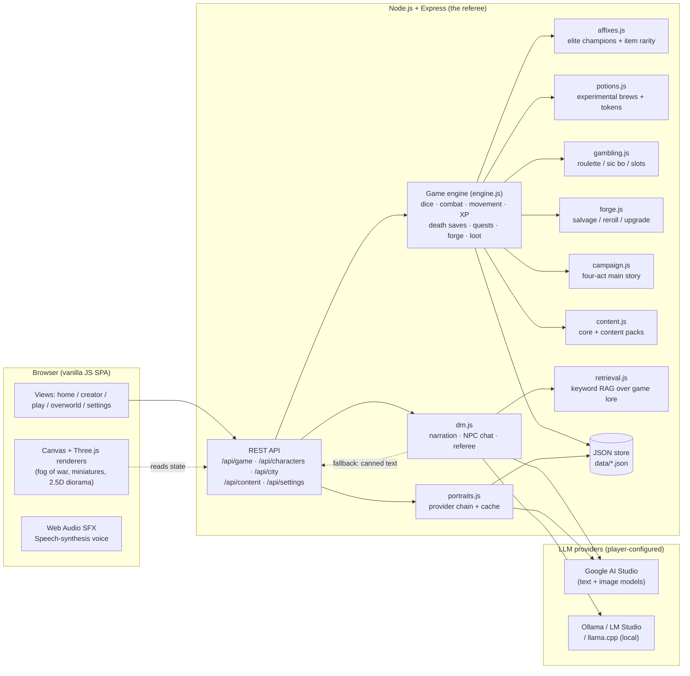
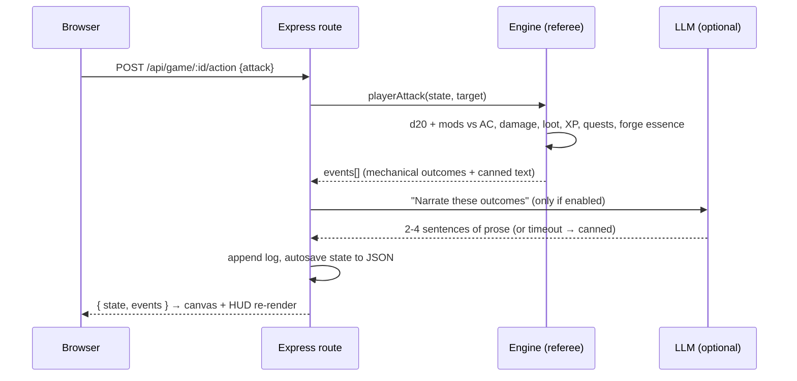

# 🏗 ARCHITECTURE — AI Dungeon developer & AI-collaboration handbook

Everything an AI (or human) contributor needs to make reliable changes: how the system works,
where every feature lives, the exact steps to extend each subsystem, and the checks that catch
mistakes before they ship.

## 1. The big picture

One Node.js process serves everything. There is no cloud: the game state lives in local JSON
files, and every AI feature talks to *whatever* OpenAI-compatible endpoint the player configures.



**The core rule: the engine decides, the LLM describes.** Dice, damage, XP, loot, forge odds,
gambling payouts, brew effects — all resolved deterministically by the engine. The LLM only
receives *resolved outcomes* and writes prose. If the LLM is off, slow, rate-limited or
hallucinating, the game keeps working from baked-in text. That is why the game is 100% playable
offline and the AI can never cheat.

## 2. One player action, end to end



Every action (move, attack, cast, interact, freeform text) flows through the same dispatch. The
referee (`server/game/referee.js`) maps freeform player text onto *real* mechanics — "I listen at
the door" becomes a Perception check — and the retrieval layer feeds the DM real lore so flavor
text can't contradict the world.

## 3. Where every feature lives

### Game systems (engine)

| File | What it does | How to extend it |
|---|---|---|
| `server/game/engine.js` | The referee: dice, combat, movement, fog of war, XP, death saves, conditions, buffs, quests, loot, rests, hazards, traps, doors | Add a function, export it from `module.exports` |
| `server/game/affixes.js` | Elite champion affixes (blazing / stone-skinned / vampiric / venomous / storm-charged) + procedural magic-item rarity tiers. `buildAffixItem()` is the single assembly path shared by loot and the forge. | Add a row to `MONSTER_AFFIXES` or `WEAPON_AFFIXES`/`ARMOR_AFFIXES` |
| `server/game/potions.js` | Three tiers of experimental brews (effect rolled at purchase, hidden until identified). `DELVE_TOKENS` for gambling prizes. Effects are built from buff ids the engine already reads. | Add a row to `POTION_EFFECTS` or `DELVE_TOKENS` |
| `server/game/gambling.js` | Roulette / sic bo / slot machine. Every table is split into a pure evaluator (`evalRoulette` etc.) + a spinner. Odds verified by exhaustive enumeration in tests. | Edit a paytable; run `tests/unit/gambling-and-potions.test.mjs` to see the new house edge |
| `server/game/forge.js` | Salvage gear into ember essence; reroll affixes; upgrade rarity. Items rebuilt through `affixes.buildAffixItem`. | Edit `FORGE_COSTS` or `SALVAGE_ESSENCE` |
| `server/game/campaign.js` | Four-act main story state machine (Relic → Vault Key → three clues → the Ember Queen). `advance()` is order-checked and idempotent. | Edit `ACTS` to add or change story beats |

### Routes (HTTP layer)

| File | Endpoints |
|---|---|
| `server/routes/game.js` | `/start` · `/:id` (get) · `/:id/action` (the big dispatch: move, attack, cast, useItem, equip, rest, freeform, chat, buy, retreat, respawn…) |
| `server/routes/characters.js` | CRUD · `/level-up` · `/equip` · `/portrait` |
| `server/routes/city.js` | `/info` · `/rest` · `/buy` · `/sell` · `/gamble` · `/forge` · `/identify` · `/claim-bounty` · `/sync-delve` · `/hall-of-heroes` · `/campaign` · `/rumor` |

### Frontend (vanilla JS SPA, no build step)

| File | What it does |
|---|---|
| `public/js/app.js` | Hash router + shared helpers (`esc`, `toast`, `loadRules`) |
| `public/js/views/play.js` | The delve screen: map render, action dispatch, combat HUD, backpack, guidance |
| `public/js/views/overworld.js` | Region map, town hub (tavern / armory / apothecary / guildhall / hall), gambling, forge |
| `public/js/views/campaign.js` | The four-act main story panel + epilogue |
| `public/js/views/levelup.js` | Interactive level-up wizard (HP / subclass / ASI / spells) |
| `public/js/map3d.js` | Three.js 2.5D diorama (camera, walking miniatures, exit beacon) |
| `public/js/map.js` | 2D canvas renderer + minimap |
| `public/js/models3d.js` | Procedural articulated miniatures (heroes, monsters, walk cycles) |
| `public/js/tooltip.js` | Universal hoverable item/monster tooltips (JSON payload for rolled gear) |
| `public/js/entity-visibility.js` | Shared board visibility + camera smoothing (pure, testable) |
| `public/js/dice.js` | Animated dice overlay (`rollAnimated`, `showDice`) |
| `public/js/sfx.js` | Web Audio synthesized SFX + ambient loop |
| `public/js/tts.js` | SpeechSynthesis voice-over (chunked, optional Piper) |

## 4. How to add things (cookbook)

Each recipe is the exact steps, in order, with the checks that must pass.

### Add a new player action

1. Add a `case 'search':` to the action dispatch in `server/routes/game.js` (the big switch).
2. Implement the logic in `server/game/engine.js` (e.g. a `searchRoom(state, events)` function).
3. Push events with `{ type: 'search', narrate: true, text: '...' }` so the LLM can narrate it.
4. Add a button or hotkey in `public/js/views/play.js` → `act({ type: 'search' })`.
5. Add the event type to `SFX_MAP` in `play.js` if it needs a sound.
6. Add an assertion to `tests/integration/combat.test.mjs` or a new integration test.

### Add a new elite affix or magic-item affix

1. Open `server/game/affixes.js`.
2. Add a row to `MONSTER_AFFIXES` (for champions) or `WEAPON_AFFIXES`/`ARMOR_AFFIXES` (for gear).
3. Run `npx eslint server/game/affixes.js` and `node tests/unit/affixes-and-loot.test.mjs`.

### Add a new experimental brew effect

1. Open `server/game/potions.js`.
2. Add a row to `POTION_EFFECTS`: `{ id, kind: 'good'|'mixed'|'bad', weight, name, desc, apply(ctx) }`.
3. The `ctx` has `{ engine, state, char, p, events, roll, tier }`. Use buff ids the engine
   already reads (`longstrider`, `blessed`, `brew_fortune`, `divine_favor`, `poisoned`…),
   `engine.adjustTempHp` for max-HP swings, `engine.blockRest` for a lost rest.
4. Run `node tests/unit/gambling-and-potions.test.mjs` — every effect is tested.

### Add a new gambling game or change a paytable

1. Open `server/game/gambling.js`.
2. Add or edit the evaluator (`evalRoulette` / `evalSicBo` / `evalSlots`) — the pure function.
3. Add a spinner wrapper if the game needs randomness.
4. Run `node tests/unit/gambling-and-potions.test.mjs` — it verifies the house edge by
   exhaustive enumeration and will report the new return-to-player percentage.

### Add a new campaign act

1. Open `server/game/campaign.js`.
2. Add a row to `ACTS`: `{ id, act, name, icon, mapIds, mapName, objective, blurb, reward }`.
3. Make sure `mapIds` reference real content maps (`content.getMap(mapId)` must return a map).
4. The advance / objective / epilogue logic adapts automatically.

### Add a new content pack

See `MODDING.md` for the full pack format. Drop the folder under `content/<your-pack>/`,
open a PR, and it ships with the game.

## 5. Data shapes (the contracts between engine, routes and views)

These are the shapes that cross the serialize boundary (`state` → JSON → browser). If you change
them, update the client views and the tests in the same commit.

### Game state (the `state` object, serialized per delve)

```
state.id                    save id ("save_xxx")
state.characterId           roster character id
state.character             deep copy of the hero (inventory, equipped, attacks, slots, uses…)
state.character.essence     ember essence earned in this delve (synced to roster on settle)
state.mapId / mapName / map
state.mode                  'explore' | 'combat' | 'victory' | 'retreat' | 'over'
state.difficulty            'easy' | 'normal' | 'hard'
state.entities[]            player + allies + monsters (alive, hp, position, conditions, buffs)
state.objects[]             doors, chests, barrels, traps, hazards, campfire, stairs
state.flags                 hasRelic, altarBlessed, victory, failed, restsBlocked, used_*, room_*
state.quests                { active, completed[] }
state.stats                 { dmgDealt, dmgTaken, kills, goldFound, rounds }
state.discovered[]          fog-of-war tile keys ("x,y")
state.world{}               per-map snapshots (monsters, objects, discovered, room flags)
state.journal[]             AI-DM journal entries
state.log[]                 mech + dm + player log lines
state.campaign              main-story progress (see campaign.js)
state.levelUp               server-computed verdict for the HUD badge (see engine.levelUpInfo)
```

### Inventory item (plain vs rolled)

```
Plain:  { itemId: 'potion_healing', qty: 2 }
Rolled: { itemId: 'longsword',                    ← base item for lookups
          uniqueId: 'affix_keen_longsword_…',     ← stable identity (equip target)
          name: '锋锐之长剑', rarity: 'magic',      ← display name + tier
          affix: 'keen', magic: 1,                ← affix id + enhancement bonus
          bonusDamage: {dice,type}|null, vampiricHeal|null,
          acBonus|null, hpBonus|null, speedBonus|null,
          cost, desc, qty }
Brew:   { itemId: 'potion_mystery_thin', uniqueId, kind: 'mystery_potion',
          tier: 'thin', identified: false, effect: { id, kind, name, desc },
          clues: ['气味…', '颜色…', '挂壁…'], qty: 1 }
Token:  { itemId: 'token_luck', uniqueId, kind: 'delve_token', delveOnly: true,
          tokenId: 'luck', name, desc, qty: 1 }
```

`delveOnly: true` items ride into one delve (`startGame` via `carryItems`) and are discarded at
settlement (`sync-delve` filters them out).

### Entity (on the map)

```
{ id: 'player' | 'ally_bram' | 'monster_3', kind: 'player'|'ally'|'monster'|'npc',
  x, y, hp, hpMax, ac, speedFt, alive, aware, fled,
  conditions: ['poisoned', …], buffs: [{ id, rounds, condId?, … }],
  attacks: [{ name, bonus, damage, damageType, range }],
  monsterId (monsters), affix (elite champions), boss (bool) }
```

## 6. Checks that run on every push (CI)

| Step | What it catches |
|---|---|
| `npx eslint .` | Duplicate declarations (the campfireOf bug), unused variables that used to be live wiring, undefined identifiers (the `char` crash) |
| `npx tsc --noEmit` | Type mismatches via JSDoc + checkJs (missing fields, wrong argument counts, `undefined` reads) |
| `node scripts/smoke-test.mjs` | End-to-end API chain: health → character → delve → shop → gamble → brew → forge → campaign → movement → combat → content packs |
| `node scripts/test-all.mjs` | 13 suites: rules engine, miniatures, affixes & loot, board & camera, gambling & brews, forge & campaign, movement, combat, tactics, progression, and three headless-browser e2e suites (3D rendering, turn economy, device adaptation) |

**Both `eslint` and `tsc` must pass with zero errors.** If you add a file with `// @ts-nocheck`,
that is a deliberate opt-out — remove it as soon as the file is ready.

## 7. Known quirks (don't re-introduce these)

- **`dmgType` vs `damageType`**: character weapon attacks use `dmgType`; monster attacks and
  spells use `damageType`. Both are read in `attackMods` / `applyDamage`. Standardizing these is
  a breaking rename — leave them as they are unless you have a full afternoon.
- **`char.uses` is a string-keyed counter bag** — TS infers `{}`, hence the `@type` annotation.
  Same for `char.pools`.
- **`state.character` is a deep copy**, not the roster character. Changes to it are synced back
  to the roster by `sync-delve` (gold, XP, inventory, level, HP) or by explicit write-through
  (equip, forge). Never assume they are the same object.
- **`engine.levelUpInfo(char)`** is the single source of truth for the level-up badge. The client
  renders from this — never add a client-side XP table (the duplicated tables caused a shipped
  badge bug).
- **`state.flags.pendingBestiaryBonus`** queues the first-kill XP so it is paid in the same
  `awardXp` call as the kill XP (ordering matters for level-ups).
- **Combat ↔ world/progression/interaction sit on dependency cycles** in the module graph. They
  work because all cross-calls happen at runtime (never at load time) and the engine is a single
  module. Splitting engine.js into per-domain files requires breaking these cycles — see the
  notes in the git history for why the first attempt was reverted.

## 8. Repo map

```
server/
  game/engine.js      the referee: dice, combat, movement, fog, XP, death saves, conditions,
                      buffs, quests, loot, rests, hazards, traps, doors, level-ups
  game/referee.js     freeform text → real skill checks (disengage, shove, search, listen…)
  game/dm.js          LLM narration, NPC role-play, quest hooks, recaps, epilogues
  game/affixes.js     elite champions + magic-item rarity/affixes (single assembly path)
  game/potions.js     experimental brews (3 tiers) + delve-only prize tokens
  game/gambling.js    roulette / sic bo / slots (pure evaluators + spinners)
  game/forge.js       salvage / reroll / upgrade (essence currency)
  game/campaign.js    four-act main story state machine + epilogue
  game/content.js     content registry (core + packs)
  game/endless.js     procedural floor generator (Endless Depths)
  game/retrieval.js   keyword RAG for the DM
  llm/client.js       OpenAI-compatible HTTP client (Google / Ollama / LM Studio / llama.cpp)
  portraits.js        portrait provider chain + cache
  routes/             characters · game · city · content · settings
shared/               D&D 2024 rules + maps as JSON
content/              shipped content packs (drowned-vault, howling-hills, sunlit-vale-expansion)
public/               SPA frontend (views, renderers, sfx, tts, tooltip system)
tests/                13 suites: unit (rules, miniatures, affixes, board, gambling, forge) +
                      integration (movement, combat, tactics, progression) +
                      e2e (3D rendering, turn economy, device adaptation)
scripts/              smoke-test (CI) · test-all (13 suites) · balance-sim
```

Performance notes: state is a single in-memory object persisted as JSON on every action
(synchronous, small); the map is one Canvas redraw per action; the only loop is a 4-second
state poll while a delve is open. A delve runs comfortably on a Raspberry Pi.
