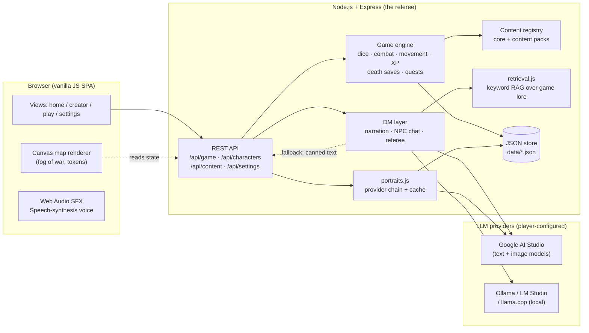
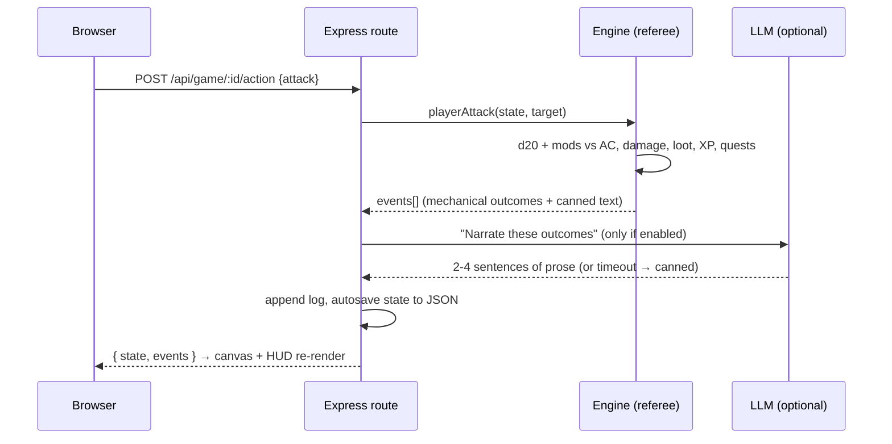
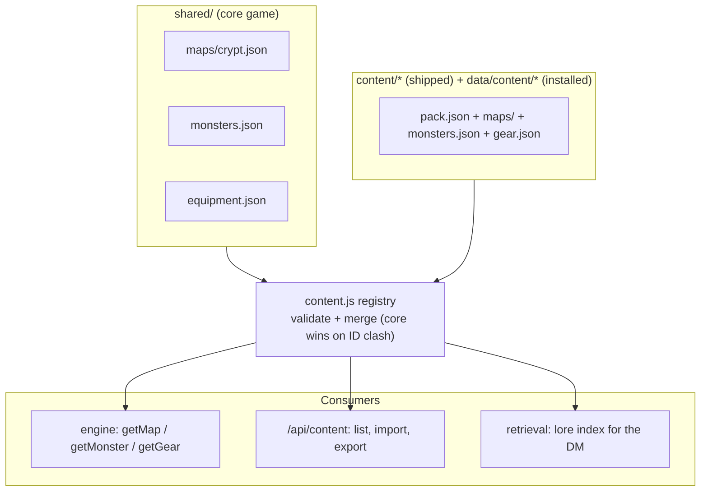
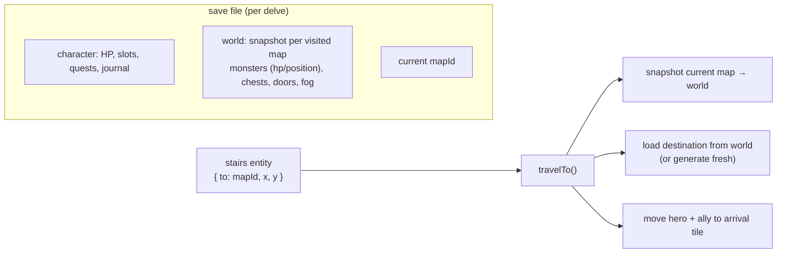

# 🏗 ARCHITECTURE — how AI Dungeon works (for developers)

A one-page tour of the system: what runs where, why the engine is the referee, and how the
LLM, the content packs and the retrieval layer fit together.

## 1. The big picture

One Node.js process serves everything. There is no cloud: the game state lives in local JSON
files, and every AI feature talks to *whatever* OpenAI-compatible endpoint the player configures.



**The core rule: the engine decides, the LLM describes.** Dice, damage, XP, loot — all resolved
deterministically by `server/game/engine.js`. The LLM only receives *resolved outcomes* and writes
prose. If the LLM is off, slow, rate-limited or hallucinating, the game keeps working from baked-in
text. That is why the game is 100% playable offline and the AI can never cheat.

## 2. One player action, end to end



Every action (move, attack, cast, interact, freeform text) flows through the same dispatch. The
referee (`server/game/referee.js`) maps freeform player text onto *real* mechanics — "I listen at
the door" becomes a Perception check — and the retrieval layer feeds the DM real lore so flavor
text can't contradict the world.

## 3. Content packs (the mod system)



A pack is a folder of JSON. Validation warnings surface on the home page; a broken pack can't
crash the game. Sharing = export one JSON file, friend imports it in the UI. Community
contributions arrive as pull requests adding `content/<pack>/`.

## 4. World state (multi-map delves)



Camps are the safe zones: campfire (long rest / journal / side quests), a trader (Marla topside,
Perra in the vault) and the stairs home. Death triggers 5e death saving throws; failing three
rolls sends the hero back to camp at half HP with the world reset — progress (looted chests,
XP, journal) is never lost.

## 5. Tech stack at a glance

| Layer | Choice | Why |
|---|---|---|
| Server | Node.js 20 + Express | one language, tiny image, no build step |
| Frontend | Vanilla ES modules + Canvas | zero framework weight, offline-friendly |
| Game state | JSON files (Docker volume) | human-readable saves, no DB to run |
| Rules data | JSON (`shared/`) | D&D 2024 content is data, not code |
| AI text | OpenAI-compatible endpoint (Google / Ollama / LM Studio / llama.cpp) | player's choice, free tiers work |
| AI images | Google image models → SD WebUI → procedural SVG | provider chain, always renders |
| Sound / voice | Web Audio + SpeechSynthesis | synthesized, zero assets |
| Retrieval | term-overlap index (`retrieval.js`) | grounding without a vector DB |
| Packaging | Docker (node:20-alpine) + GitHub Actions → GHCR | one-command play |

## 6. Repo map

```
server/
  game/engine.js      the referee: dice, combat, movement, fog, XP, death saves
  game/referee.js     freeform text → real skill checks
  game/dm.js          LLM narration, NPC role-play, quest hooks, recaps
  game/content.js     content registry (core + packs)
  game/retrieval.js   keyword RAG
  portraits.js        portrait provider chain + cache
  routes/             characters · game actions · settings · content · data
shared/               D&D 2024 rules + maps as JSON
content/              shipped content packs (community PRs welcome)
public/               SPA frontend (views, canvas renderer, sfx, tts)
scripts/              smoke-test (CI) · balance-sim (tuning harness)
```

Performance notes: state is a single in-memory object persisted as JSON on every action
(synchronous, small); the map is one Canvas redraw per action; the only loop is a 4-second
state poll while a delve is open. A delve runs comfortably on a Raspberry Pi.
