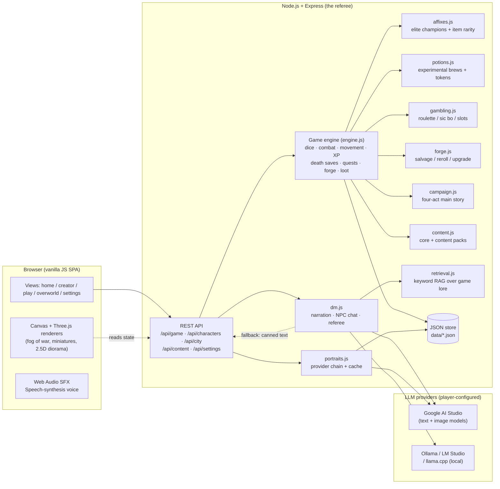
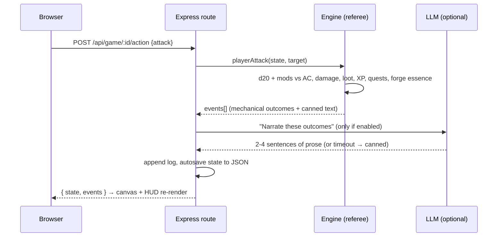

# 🏗 ARCHITECTURE — AI Dungeon developer & AI-collaboration handbook

Everything an AI (or human) contributor needs to make reliable changes: how the system works,
where every feature lives, the exact steps to extend each subsystem, and the checks that catch
mistakes before they ship. Ground rules, verification commands and the doc map live in
`AGENTS.md` (auto-loaded by AI coding tools; `CLAUDE.md` points at it) — this file is the deep dive.

First-time contributors: read [START_HERE.md](START_HERE.md), then the current summary in
PROJECT_STATE.md and your assigned specification in [tasks/README.md](tasks/README.md).
The current design direction is in [docs/GAME_DESIGN.md](docs/GAME_DESIGN.md).
The 2026-09-30 review found known gaps in start-option wiring (T1), asynchronous state writes
and narration persistence (T2), and whole-delve settlement idempotency (T3). T1 is done:
`api.startGame(characterId, options)` takes one explicit `StartGameOptions` object (JSDoc-typed,
tsc-enforced) and the prepare page / region dispatch / weekly trial all pass map, difficulty and
companion through. T2 now commits mechanics synchronously and merges model results into the
latest save. A follow-up review reproduced stale polling responses bypassing the client rev
guard and concurrent same-NPC chat history overwrites; those T2a boundaries are fixed. T3 (the
one-settlement-per-end contract) and the T3a boundary fixes (legacy endSeq baseline, stale-mirror
repair, keyboard/scripted navigation lock in the summary) are implemented and verified — see the
settlement bullet in §7 and `tasks/t3a-settlement-boundaries.md`. T4 (server-computed player
guidance: home/region-map next step, delve HUD objective and combat economy line, summary gains
and next objective) is done too — see the guidance bullet in §7 and
`tasks/t4-player-guidance.md`. The T4a boundary fixes (goal-obtained copy matched to the
engine's campfire-victory adjudication; `pickLiveSave` priority so a newer settled save can't
hide an active delve) are done too — see the guidance bullet in §7 and
`tasks/t4a-guidance-outcomes.md`. T5 (quick start: two server-defined preset heroes, one-tap
prepare-entrance routing, an observe-only skippable first-delve coach) is done — see the
quick-start bullet in §7 and `tasks/t5-first-adventure.md`. T7 (server-authoritative
lockbox/trap/road-encounter adjudication with faithful dice presentation) is done too — see the
T7 bullet in §7 and `tasks/t7-server-checks.md`. T8 adds two-phase content validation and
transactional imports (see below); T6 remains planned and must extend that validator.

Content validation (T8): `server/game/content-validation.js` is a pure JSON validator with no
engine imports. `content.scan` checks and normalizes fields, registers core → shipped → installed
definitions, then resolves references across the complete registry. Invalid dependencies are
removed transitively. Within each pack root, folder names are sorted; duplicate diagnostics carry
the winning source. Core's `dire_wolf` remains effective. `scan({cache:false})` leaves the live
registry untouched; import dry-runs use the same folder order as actual installation.

`GET /api/content` retains text `warnings` and adds structured `diagnostics` (`severity`, `code`,
pack/file/field/message). `GET /api/content/validate` checks the registry; `POST /api/content/validate`
checks an import bundle without writes. `POST /api/content/import` rejects fatal errors before
writing and rejects replacements that break previously valid dependencies. A valid replacement
is staged under DATA_DIR/.content-imports outside the scanned content root, then renamed into
place with a backup for rollback. Obsolete pack files disappear. If rollback itself fails, the
backup is retained and its path reported. This synchronous transaction has no model waits.

`getMap` defaults only when no selection is supplied; unknown/invalid explicit IDs return null.
The start route rejects them before consuming prizes/boons or saving; engine start/travel also
guard missing maps and invalid arrival coordinates. Trusted procedural maps still use `injectMap`;
they are not imported JSON packs. Legacy victoryTile, inferred dimensions and empty collections
remain supported, and unknown author fields survive normalization. Reachability is a warning
under optimistic door/destructible/monster assumptions, not a proof of playability.

Map entities may explicitly override a monster definition's `boss` boolean; hydration, elite
eligibility and slay_boss validation all use that effective flag. NPC marker objects retain npcId,
so an otherwise valid canned NPC interaction cannot crash during hydration. T8 also repairs
wall-bound actors/chests/spawns and noncanonical campfire IDs in the shipped howling-hills and
Sunlit Vale maps; stats/loot tables are unchanged. New map data applies to new delves; existing
save snapshots are not rewritten. The complete example is
[minimal-pack.json](tests/fixtures/content/minimal-pack.json); rules and author workflow are in
[MODDING.md](MODDING.md), and the read-only checker is `scripts/check-content.mjs`.

## 1. The big picture

Automated verification uses `npm run verify` → `scripts/docker-verify.mjs` → `Dockerfile.test`.
The dedicated Linux container owns the server, all tests and Chromium (required WebGL2 via
SwiftShader). It has 2 CPUs / 4 GiB RAM, network disabled and fresh temporary test data;
only per-run artifacts are mounted. The fixed Docker name serializes full runs across agents.
The container executes the real `npm run verify`, exits with its result and is removed on all
normal/failure/timeout paths. MCP and CI share the same entrypoint; see [Docker testing](docs/DOCKER_TESTING.md).

One Node.js process serves everything. There is no cloud: the game state lives in local JSON
files, and every AI feature talks to *whatever* OpenAI-compatible endpoint the player configures.


```mermaid
flowchart LR
    subgraph Browser["Browser (vanilla JS SPA)"]
        UI["Views: home / creator / play / overworld / settings"]
        CV["Canvas + Three.js renderers<br/>(fog of war, miniatures, 2.5D diorama)"]
        SFX["Web Audio SFX<br/>Speech-synthesis voice"]
    end
    subgraph Server["Node.js + Express (the referee)"]
        API["REST API<br/>/api/game · /api/characters · /api/city<br/>/api/content · /api/settings"]
        ENG["Game engine (engine.js)<br/>dice · combat · movement · XP<br/>death saves · quests · forge · loot"]
        AFF["affixes.js<br/>elite champions + item rarity"]
        POT["potions.js<br/>experimental brews + tokens"]
        GAM["gambling.js<br/>roulette / sic bo / slots"]
        FOG["forge.js<br/>salvage / reroll / upgrade"]
        CAMP["campaign.js<br/>four-act main story"]
        REG["content.js<br/>core + content packs"]
        DM["dm.js<br/>narration · NPC chat · referee"]
        RET["retrieval.js<br/>keyword RAG over game lore"]
        DB[("JSON store<br/>data/*.json")]
        POR["portraits.js<br/>provider chain + cache"]
    end
    subgraph AI["LLM providers (player-configured)"]
        G["Google AI Studio<br/>(text + image models)"]
        O["Ollama / LM Studio<br/>/ llama.cpp (local)"]
    end
    UI --> API
    CV -. reads state .-> API
    API --> ENG
    ENG --> AFF
    ENG --> POT
    ENG --> GAM
    ENG --> FOG
    ENG --> CAMP
    ENG --> REG
    ENG --> DB
    API --> DM
    DM --> RET
    DM --> G
    DM --> O
    DM -. fallback: canned text .-> API
    API --> POR
    POR --> G
    POR --> DB
```

**The core rule: the engine decides, the LLM describes.** Dice, damage, XP, loot, forge odds,
gambling payouts, brew effects — all resolved deterministically by the engine. The LLM only
receives *resolved outcomes* and writes prose. If the LLM is off, slow, rate-limited or
hallucinating, the game keeps working from baked-in text. That is why the game is 100% playable
offline and the AI can never cheat.

## 2. One player action, end to end


```mermaid
sequenceDiagram
    participant B as Browser
    participant R as Express route
    participant E as Engine (referee)
    participant L as LLM (optional)
    B->>R: POST /api/game/:id/action {attack}
    R->>E: playerAttack(state, target)
    E->>E: d20 + mods vs AC, damage, loot, XP, quests, forge essence
    E-->>R: events[] (mechanical outcomes + canned text)
    R->>L: "Narrate these outcomes" (only if enabled)
    L-->>R: 2-4 sentences of prose (or timeout → canned)
    R->>R: append log, autosave state to JSON
    R-->>B: { state, events } → canvas + HUD re-render
```

Every action (move, attack, cast, interact, freeform text) flows through the same dispatch. The
referee (`server/game/referee.js`) maps freeform player text onto *real* mechanics — "I listen at
the door" becomes a Perception check — and the retrieval layer feeds the DM real lore so flavor
text can't contradict the world.

## 3. Where every feature lives

### Game systems (engine)

| File | What it does | How to extend it |
|---|---|---|
| `server/game/engine.js` | The referee: dice, combat, movement, fog of war, XP, death saves, conditions, buffs, quests, loot, rests, hazards, traps, doors | Add a function, export it from `module.exports` |
| `server/game/affixes.js` | Elite champion affixes (blazing / stone-skinned / vampiric / venomous / storm-charged) + procedural magic-item rarity tiers + item sets (`ARMOR_SETS`: 25% of armour-pool rolls carry a set tag; 2pc/3pc tiered AC + initiative, resolved live by `engine.setAcBonus`). `buildAffixItem()` is the single assembly path shared by loot and the forge. | Add a row to `MONSTER_AFFIXES`, `WEAPON_AFFIXES`/`ARMOR_AFFIXES`, or `ARMOR_SETS` |
| `server/game/potions.js` | Three tiers of experimental brews (effect rolled at purchase, hidden until identified). `DELVE_TOKENS` for gambling prizes. Effects are built from buff ids the engine already reads. | Add a row to `POTION_EFFECTS` or `DELVE_TOKENS` |
| `server/game/gambling.js` | Roulette / sic bo / slot machine. Every table is split into a pure evaluator (`evalRoulette` etc.) + a spinner. Odds verified by exhaustive enumeration in tests. | Edit a paytable; run `tests/unit/gambling-and-potions.test.mjs` to see the new house edge |
| `server/game/forge.js` | Salvage gear into ember essence; reroll affixes; upgrade rarity. Items rebuilt through `affixes.buildAffixItem`. | Edit `FORGE_COSTS` or `SALVAGE_ESSENCE` |
| `server/game/campaign.js` | Four-act main story state machine (Relic → Vault Key → three clues → the Ember Queen). `advance()` is order-checked and idempotent. | Edit `ACTS` to add or change story beats |
| `server/game/guidance.js` | Deterministic next-step copy (T4): `journey()` for home/region map/summary, `delve()` for the HUD objective and combat economy line. No LLM, no RNG, no leaks. | Edit the templates/`MAP_NAMES`; field contract in §7 |
| `server/game/presets.js` | T5 quick-start recommended heroes (melee guardian + caster arcane): client-facing metadata (`listPresets()`) plus the `buildCharacter` drafts (`draftFor(id)`). The client only ever sends `presetId` + optional name. | Edit a preset's draft/copy; run `tests/integration/quick-start.test.mjs` — it rebuilds both through the real engine rules |

### Routes (HTTP layer)

| File | Endpoints |
|---|---|
| `server/routes/game.js` | `/start` (refuses an unresolved road encounter, T7a) · `/:id` (get) · `/:id/preview` (read-only deterministic check previews, T7a) · `/:id/action` (the big dispatch: move, attack, cast, useItem, equip, rest, freeform, chat, buy, retreat, respawn…) |
| `server/routes/characters.js` | CRUD (creation accepts `presetId` for the T5 quick start — the preset draft wins over client fields, the response carries `guidance`) · `/level-up` · `/equip` · `/portrait` · `/road-encounter` (fixed outcome table; delve-scoped boons ride as `pendingRoadBoons`) |
| `server/routes/city.js` | `/info` · `/rest` · `/buy` · `/sell` · `/gamble` · `/forge` · `/identify` · `/claim-bounty` · `/sync-delve` · `/hall-of-heroes` · `/campaign` · `/rumor` |

### Frontend (vanilla JS SPA, no build step)

| File | What it does |
|---|---|
| `public/js/app.js` | Hash router + shared helpers (`esc`, `toast`, `loadRules`) |
| `public/js/views/play.js` | The delve screen entry: map render, action dispatch, combat HUD, side panel (`renderSide`/`combatHud`/`wireSide` stay here by design — the level-up handler reassigns `game` itself) |
| `public/js/views/play/panels.js` | Delve panels extracted from play.js: shop / journal / skill-check / end-of-delve summary (`createPanels(ctx)`) |
| `public/js/views/play/tutorial.js` | T5 first-delve coach: a floating card (move → interact → combat → settle) that only observes server state/events; skippable, once per install (`createDelveTutorial()`) |
| `public/js/views/play/ribbon.js` | The tactical initiative ribbon (`renderInitiativeRibbon(game, onSelectTarget)`) |
| `public/js/views/play/delve-inventory.js` | The in-delve backpack & equipment modal (`createDelveInventory(ctx)`) |
| `public/js/views/overworld.js` | Region map + town hub entry: routing, header/map events, district switch |
| `public/js/views/overworld/districts.js` | The six district renderers + their events + gambling state (`createDistricts(ctx)`) |
| `public/js/views/overworld/road-encounter.js` | The road-encounter modal (`showRoadEncounterModal`) |
| `public/js/views/campaign.js` | The four-act main story panel + epilogue |
| `public/js/views/levelup.js` | Interactive level-up wizard (HP / subclass / ASI / spells) |
| `public/js/map3d.js` | Three.js 2.5D diorama (camera, walking miniatures, exit beacon) |
| `public/js/map.js` | 2D canvas renderer + minimap |
| `public/js/models3d.js` | Procedural articulated miniatures (heroes, monsters, walk cycles) |
| `public/js/tooltip.js` | Universal hoverable item/monster tooltips (JSON payload for rolled gear) |
| `public/js/entity-visibility.js` | Shared board visibility + camera smoothing (pure, testable) |
| `public/js/dice.js` | Animated dice overlay (`rollAnimated`, `showDice`) |
| `public/js/sfx.js` | Web Audio synthesized SFX + ambient loop |
| `public/js/tts.js` | SpeechSynthesis voice-over (chunked, optional Piper) |

## 4. How to add things (cookbook)

Each recipe is the exact steps, in order, with the checks that must pass.

### Add a new player action

1. Add a `case 'search':` to the action dispatch in `server/routes/game.js` (the big switch).
2. Implement the logic in `server/game/engine.js` (e.g. a `searchRoom(state, events)` function).
3. Push events with `{ type: 'search', narrate: true, text: '...' }` so the LLM can narrate it.
4. Add a button or hotkey in `public/js/views/play.js` → `act({ type: 'search' })`.
5. Add the event type to `SFX_MAP` in `play.js` if it needs a sound.
6. Add an assertion to `tests/integration/combat.test.mjs` or a new integration test.

### Add a new elite affix or magic-item affix

1. Open `server/game/affixes.js`.
2. Add a row to `MONSTER_AFFIXES` (for champions) or `WEAPON_AFFIXES`/`ARMOR_AFFIXES` (for gear).
3. Run `npx eslint server/game/affixes.js` and `node tests/unit/affixes-and-loot.test.mjs`.

### Add a new experimental brew effect

1. Open `server/game/potions.js`.
2. Add a row to `POTION_EFFECTS`: `{ id, kind: 'good'|'mixed'|'bad', weight, name, desc, apply(ctx) }`.
3. The `ctx` has `{ engine, state, char, p, events, roll, tier }`. Use buff ids the engine
   already reads (`longstrider`, `blessed`, `brew_fortune`, `divine_favor`, `poisoned`…),
   `engine.adjustTempHp` for max-HP swings, `engine.blockRest` for a lost rest.
4. Run `node tests/unit/gambling-and-potions.test.mjs` — every effect is tested.

### Add a new gambling game or change a paytable

1. Open `server/game/gambling.js`.
2. Add or edit the evaluator (`evalRoulette` / `evalSicBo` / `evalSlots`) — the pure function.
3. Add a spinner wrapper if the game needs randomness.
4. Run `node tests/unit/gambling-and-potions.test.mjs` — it verifies the house edge by
   exhaustive enumeration and will report the new return-to-player percentage.

### Add a new campaign act

1. Open `server/game/campaign.js`.
2. Add a row to `ACTS`: `{ id, act, name, icon, mapIds, mapName, objective, blurb, reward }`.
3. Make sure `mapIds` reference real content maps (`content.getMap(mapId)` must return a map).
4. The advance / objective / epilogue logic adapts automatically.

### Add a new content pack

See `MODDING.md` for the full pack format. Drop the folder under `content/<your-pack>/`,
open a PR, and it ships with the game.

## 5. Data shapes (the contracts between engine, routes and views)

These are the shapes that cross the serialize boundary (`state` → JSON → browser). If you change
them, update the client views and the tests in the same commit.

### Game state (the `state` object, serialized per delve)

```
state.id                    save id ("save_xxx")
state.characterId           roster character id
state.rev                   bumped on EVERY persisted write — the client rejects whole-state
                            snapshots older than what it already shows (T2 aux-response guard)
state.character             deep copy of the hero (inventory, equipped, attacks, slots, uses…)
state.character.essence     ember essence earned in this delve (synced to roster on settle)
state.mapId / mapName / map
state.mode                  'explore' | 'combat' | 'victory' | 'retreat' | 'over'
state.difficulty            'easy' | 'normal' | 'hard'
state.entities[]            player + allies + monsters (alive, hp, position, conditions, buffs)
state.objects[]             doors, chests, barrels, traps, hazards, campfire, stairs
state.flags                 hasRelic, altarBlessed, victory, failed, restsBlocked, used_*, room_*
state.quests                { active, completed[] }
state.stats                 { dmgDealt, dmgTaken, kills, goldFound, rounds }
state.discovered[]          fog-of-war tile keys ("x,y")
state.world{}               per-map snapshots (monsters, objects, discovered, room flags)
state.journal[]             AI-DM journal entries
state.log[]                 mech + dm + player log lines
state.campaign              main-story progress (see campaign.js)
state.levelUp               server-computed verdict for the HUD badge (see engine.levelUpInfo)
```

### Inventory item (plain vs rolled)

```
Plain:  { itemId: 'potion_healing', qty: 2 }
Rolled: { itemId: 'longsword',                    ← base item for lookups
          uniqueId: 'affix_keen_longsword_…',     ← stable identity (equip target)
          name: '锋锐之长剑', rarity: 'magic',      ← display name + tier
          affix: 'keen', magic: 1,                ← affix id + enhancement bonus
          bonusDamage: {dice,type}|null, vampiricHeal|null,
          acBonus|null, hpBonus|null, speedBonus|null,
          cost, desc, qty }
Brew:   { itemId: 'potion_mystery_thin', uniqueId, kind: 'mystery_potion',
          tier: 'thin', identified: false, effect: { id, kind, name, desc },
          clues: ['气味…', '颜色…', '挂壁…'], qty: 1 }
Token:  { itemId: 'token_luck', uniqueId, kind: 'delve_token', delveOnly: true,
          tokenId: 'luck', name, desc, qty: 1 }
```

`delveOnly: true` items ride into one delve (`startGame` via `carryItems`) and are discarded at
settlement (`sync-delve` filters them out).

### Entity (on the map)

```
{ id: 'player' | 'ally_bram' | 'monster_3', kind: 'player'|'ally'|'monster'|'npc',
  x, y, hp, hpMax, ac, speedFt, alive, aware, fled,
  conditions: ['poisoned', …], buffs: [{ id, rounds, condId?, … }],
  attacks: [{ name, bonus, damage, damageType, range }],
  monsterId (monsters), affix (elite champions), boss (bool),
  loyalty (allies: 0-100 morale, seeded from char.companionLoyalty[allyId]) }
```

## 6. Checks that run on every push (CI)

| Step | What it catches |
|---|---|
| `npx eslint .` | Duplicate declarations (the campfireOf bug), unused variables that used to be live wiring, undefined identifiers (the `char` crash) |
| `npx tsc --noEmit` | Type mismatches via JSDoc + checkJs (missing fields, wrong argument counts, `undefined` reads). server/ **and all of public/js** are covered — the include list is a glob, so new files are checked automatically. The vendored Three.js import is mapped by `paths` to the permissive stub `public/js/vendor-three.d.ts`; shared window/document expandos live in `public/js/globals.d.ts` |
| `node scripts/smoke-test.mjs` | End-to-end API chain: health → character → delve → shop → gamble → brew → forge → campaign → movement → combat → content packs |
| `node scripts/test-all.mjs` | 23 suites: rules engine, miniatures, affixes & loot, board & camera, gambling & brews, forge & campaign, MCP server, store versioning, event contract, delve-replay bot (API invariants), movement, combat, tactics, progression, state & AI persistence (mock-LLM race tests), settlement contract (T3/T3a), unified server checks & road encounters (T7/T7a), quick-start presets & creation (T5/T5a), and five headless-browser e2e suites (3D rendering, turn economy, device adaptation, quick start & tutorial, road lifecycle & check previews) |

**Both `eslint` and `tsc` must pass with zero errors.** If you add a file with `// @ts-nocheck`,
that is a deliberate opt-out — remove it as soon as the file is ready.

## 7. Known quirks (don't re-introduce these)

- **Same-save write contract (T2).** Every mutation of a delve save is a synchronous
  read-modify-write of the LATEST file (`store.getSave` → mutate → `store.saveGame`, no
  awaits in between — atomic in the event loop). Model/LLM waits NEVER happen while holding
  a snapshot: the action route queues them into `pending`, runs them outside any lock with
  the saved snapshot as prompt context only, then merges back **only their own fields**
  (log lines, journal, `appearances`, chat history, quest text) onto a freshly-read state.
  Narration is stamped with an `actionId` (`log[i].aid`) and merged by `applyNarration`
  (canned lines of that action are dropped, the DM prose is appended once — dedupe by aid).
  Never add an await between `getSave` and `saveGame` in `routes/game.js` — that gap is
  exactly the bug where a slow `describe` rewound the player's position. `store.withSaveLock`
  serializes the async merge phases; it must never be held across a model request.
  On the client, `adoptState` in `play.js` is the single gate for adopting a whole server
  state: it rejects a different save's snapshot (`next.id !== game.id`) and anything older
  than the shown `rev` (equal rev is fine — a fresh GET of the same save). The 4s poll, the
  level-up GET and the action/aux responses all go through it; the poll callback also checks
  `viewAlive`, and every playView mounts under a `viewToken`, so a response that lands after
  the view ended (or after a newer view mounted) is dropped — the initial GET in `playView`
  is the only direct assignment (initialization boundary). Chat history is merged per
  action: each chat appends exactly its own aid-tagged user/assistant pair onto the latest
  save's `npcChat[npcId]` in completion order (24-entry cap, dedupe by aid) — never copy the
  prompt snapshot's whole history over it. The portrait cache lives in a module-level
  `portraitCache` (server snapshots never carry client-side caches).

- **One settlement per ended delve (T3, boundaries fixed in T3a).** `POST /api/city/sync-delve`
  settles an ENDED delve
  (mode `victory` / `retreat` / `over`) exactly once. The settlement identity is
  `<saveId>#<endSeq>` — `endSeq` is stamped by the engine every time a delve ENTERS an end
  state (engine death, `checkVictory`, and the route's `retreat` case; respawn keeps the
  counter so a second death settles again as `#2`). It is deliberately NOT `rev`: narration
  and auxiliary writes keep bumping `rev`, and must never mint a second settlement. Legacy
  end-mode saves that predate the counter get `endSeq = 1` baselined by the store migration
  ON READ (they settle as `#1`, and the next real end after a respawn becomes `#2` instead of
  colliding with the old receipt) — re-deriving the baseline per read means a failed mirror
  write cannot lose it. The
  receipt (`{ id, ts, mode, mapId, mapName, gold, xp, level, delveNumber, campaignAdvanced,
  weeklyWin }`) lives on the roster (`char.settlements`, capped at 100) — that copy is the
  authority, written FIRST; if the roster write fails nothing is persisted anywhere and the
  retry re-processes from the untouched delve snapshot. The delve save mirrors the receipt
  on `state.settled` (best-effort, after the roster): a replayed request returns the same
  receipt with `duplicate: true` and touches nothing, a roster restored without its receipts
  dedupes from the mirror (and heals its receipt list), and the duplicate path heals the
  mirror when it is MISSING **or STALE** (an older settle's mirror that survived a failed
  newer mirror write is repaired to the current receipt). Validation happens before any
  mutation: unknown hero/save → 404, a save
  owned by another hero → 403, a not-ended or snapshot-less delve → 400 — the old no-save
  incremental path (`goldGained`/`xpGained`/`newItems` from the request body) is REMOVED, it
  had no caller left and trusted client numbers as authoritative rewards. The summary panel
  (`play/panels.js`) shows saving/saved/failed and keeps the return links and respawn locked
  until the settle is confirmed: `.btn.locked` (pointer-events) covers the mouse, and a click
  guard plus `aria-disabled`/`tabindex="-1"` covers real Enter keys, assistive tech and
  scripted `.click()` calls; the gold row only says "banked" after the server confirms.
  Review/close/backdrop stay usable while locked, and a failure offers a retry.

- **Server-computed player guidance (T4).** `server/game/guidance.js` is the single source of
  the "what now?" copy — deterministic templates, no LLM and no RNG, so the loop stays
  playable with AI off. Two functions, two shapes, both additive on existing payloads:
  - `journey(char, { liveSave })` rides `/api/characters` (per hero), `/api/city/info`,
    `/api/city/campaign` and the `sync-delve` response. Fields: `stage`
    (`unsettled` | `in_delve` | `preparing` | `complete`), `label` (campaign progress),
    `objective` (the campaign's public objective), `primary` (`{ kind: 'resume'|'prepare'|
    'map'|'campaign', saveId?, mapId?, text, reason }`) and a small `options` list.
    `pickLiveSave` picks what the primary action continues, by priority (T4a): an
    ended-but-unsettled delve first (spoils must not be lost), then a RUNNING delve
    (explore/combat — a newer settled end must not hide an older active one), then the most
    recent save (a settled one; journey treats it as "no active delve" and points at the
    next story step). Settled is decided by the roster receipt OR the matching mirror
    (T3 authority rules — a lost mirror doesn't fake an unsettled delve, and a mirror that
    matches neither the save's endSeq nor any receipt proves nothing). Within a group the
    newest `updatedAt` wins. The client only maps actions to
    hash routes (`#/play/<id>`, `#/overworld?char=…&node=<mapId>`, `#/campaign/<id>`); every
    real action is still validated by its own route on submit — guidance can never change a
    game result or auto-embark/spend.
  - `delve(save)` rides `sanitize` as `state.guidance`. Fields: `stage` (`explore` |
    `objective` | `cleared` | `combat` | `victory` | `retreat` | `defeat`), `objective` (the
    HUD pill line), `hint` (hover-bar default copy)
    and, in combat, `combat` (`{ yourTurn, movementLeftFt, action, bonus, potions, notes }`)
    — the economy line spells out which action is spent and why (the client renders it as
    `.guidance-combat-line`; the disabled buttons' title tooltips stay for hover). The copy
    must match the engine's actual adjudication (T4a): `objective` (goal in hand, still
    explore) sends the player to WALK ONTO the campfire tile — that is what fires
    `checkVictory`, the story advance and the victory reward; an entrance/campfire retreat
    is legal but only settles current spoils and never advances the story, so both the
    guidance and the retreat button say so. `cleared` (no living monsters, goal pending) is
    NOT a completion — it offers continue-or-retreat with `returnPrompt: false`.
  - Leak rules: copy comes only from static map metadata the player already sees (map names,
    `objectiveText`) and the campaign objective — never coordinates, undiscovered entities,
    trap positions or loot tables.
  - New default copy is Simplified Chinese (proper names kept). Home cards, the region-map
    banner/sidebar ("📜 主线推荐" + reason), the delve HUD and the summary all render the
    server text; the summary additionally shows the settle receipt's `gains`
    (`{ gold, xp, levels }` — the real delta vs the pre-settle roster) and folds the raw
    statistics into a `<details>`.
  - `store.listSaves()` carries `mapId` / `mode` / `endSeq` / `settled` so guidance can tell
    a running delve from an ended-unsettled one from a settled one without extra reads.

- **Quick start & first-delve coach (T5).** Two additions that must stay server-owned and
  observe-only:
  - Presets: `server/game/presets.js` holds the two recommended hero drafts (melee
    `guardian`, caster `arcane`). The home quick-start card renders ONLY the server
    metadata from `/api/rules` (`presets`) and POSTs `{ presetId, name }`; `POST
    /api/characters` resolves the draft via `presets.draftFor()` and builds through the
    real `engine.buildCharacter` — the preset always wins over client-sent fields, an
    unknown `presetId` is a 400, and an empty name falls back to the preset default. The
    POST response additionally carries `guidance` (same shape as GET /) so the client can
    route to the recommended prepare entrance (`?node=<mapId>`) without deriving story
    state client-side — it still never auto-embarks. Known creation gap kept out of the
    presets: `buildCharacter` ignores speciesChoices for skills, so preset drafts pass
    species picks as `draft.skills` (do not "fix" the drafts, fix buildCharacter).
  - Coach: `public/js/views/play/tutorial.js` (`createDelveTutorial`) renders a floating
    card driven by move → interact → combat → settle. Steps advance ONLY from adopted
    server state (player position, `mode`, `stats.kills`, the `settled` mirror) or the
    server's own action response (an `interact` — or a T7 `skillCheckObject` — without an
    `error` event); it never sends actions and never reads client-side rolls. One-time per
    install via localStorage `aiDnd.tutorial.v1` (`active`/`done`/`skipped` + done list —
    a reload resumes the current step instead of restarting, done/skipped never shows
    again). play.js wiring is six lines: create after panels, `maybeStart` after first
    render, `observe` from `update()`/`act()`, `destroy` in the view cleanup.

- **Client display boundaries found by the T5/T7 integration browser run (don't re-introduce)**:
  - The crypt's altar and relic share tile (12,22); a first-match object lookup shadowed
    the relic forever and made the stage-0 objective unclickable in the UI (API-level
    tests and the replay bot never render, so this hid for the whole project). The click
    path in play.js now cycles through the objects on a repeatedly-clicked tile
    (`tilePick`); targeting only — the server still adjudicates by `objectId`.
  - A natural-1 death save adds TWO failures, so a hero can die at `deathSaves.fail = 4`;
    rendering `'○'.repeat(3 - fail)` then threw `Invalid count value: -1` and bricked the
    delve view on every reopen. The side-panel death-save display now clamps counts to
    [0, 3].
  - Respawn exists twice (the summary panel's button and the side panel's `data-act`
    button). Both must reset `summaryShown`, or the NEXT end state (victory/death/retreat)
    never auto-opens its settle summary and the player has no UI path to settle it.
- **Server-authoritative skill checks & road encounters (T7)**:
  - **Chest and trap checks**: `server/routes/game.js` (`skillCheckObject`) delegates strictly to `engine.unlockChest(state, obj, method, events)` and `engine.disarmTrap(state, obj, events)`. Client-sent `rollTotal` is completely ignored. Engine checks enforce thieves' tools requirements (`thieves_tools` or `tool_thieves` in inventory for lock picking and trap disarm; athletics for lock forcing), roll d20 using engine RNG (supporting rogue retry/advantage), mutate object states (`unlocked`, `disarmed`, `triggered`), and emit `chest_unlocked`/`chest_locked` or `trap_disarmed`/`trap_disarm_failed` events with payload `{ objectId, method, natural, modifier, total, dc, outcome, success }`.
  - **Animated dice presentation**: `public/js/dice.js`'s `rollAnimated(sides, label, fixedResult)` accepts the server's `natural` die roll. The client UI disables action buttons, dispatches the action to the server, and uses `ev.data.natural` for visual dice animation so the presentation always faithfully reflects the server's adjudication.
  - **Road encounters (T7 + T7a lifecycle)**: Server tracks the live instance on `char.currentRoadEncounter = { id, instanceId, options, resolved, resolvedChoice, result }`. `engine.resolveRoadEncounter` validates choice against active options, validates player resources (10 GP for bribe, 5 GP for offering), rolls engine checks (fight DC 11, sneak DC 12), applies rewards/wounds/boons (`pendingRoadBoons`), marks `resolved: true`, and deduplicates re-submissions (`alreadyResolved: true`) to prevent repeat awards.
  - **T7a instance lifecycle**: a live instance is authoritative from trigger to start — `engine.triggerRoadEncounter` returns an existing instance (unresolved OR resolved-but-unconsumed) untouched via `roadEncounterView` (engine-built template + instanceId + resolution; ambush views also carry engine-computed `checks` modifiers so the modal never previews client math); NO re-roll, NO instanceId overwrite, NO RNG consumed. The same view answers `action:'status'` (pure read). `POST /api/game/start` refuses an UNRESOLVED instance with 409 (+ instance view) so it can never be silently skipped; a resolved instance passes through and is consumed exactly once at start (boons applied, instance cleared). Compatibility policy: bots/old clients never trigger, so they hold no pending instance and are unaffected; an old client that triggers but cannot handle 409 is a path this round fixed. The client (`overworld.js startEmbarkFlow` + `road-encounter.js`) guards from the first Embark click, surfaces trigger/resolve/start failures as toasts (never a silent start), restores a pending instance on prepare-page mount via status, and keeps the modal open for retry when a resolve response is lost (the server may already have applied the choice — the idempotent retry makes it exactly-once).
  - **View teardown is part of the lifecycle**: `overworldView`'s cleanup bumps `overworldToken` and resets `embarkBusy`, so leaving the prepare page (home / settings / any view) makes every in-flight trigger/status/restore/continue callback see `alive() === false` — late responses act on nothing and the server-side instance stays pending for the next mount to restore. Any later overworld mount takes a fresh token, so successors are unaffected.
  - **Start results must survive the callback chain**: the restore-modal continue path (`startEmbarkFlow(..., knownEncounter)`) returns `embarkAction()`'s boolean; a failed start keeps the modal with a re-enabled continue button (retry re-sends start only — no re-resolve, no re-award). Never let an intermediate `await` path swallow the result.
  - **Check previews (T7a)**: `POST /api/game/:id/preview` (`engine.previewSkillCheckObject`, read-only — no save write, no rev bump, no RNG, no buff consumption) returns the methods/DCs/base modifiers the resolve WILL roll with (`skillMod` incl. expertise, tools proficiency only when the skill itself isn't proficient) plus state-dependent extras as NOTES (guidance/inspiration/lucky reroll/rogue retry), never as fake constants. The client check modal renders this preview and keeps NO local proficiency/expertise/tools math; when the preview is unreachable it shows methods + DC without numbers. The final `natural/modifier/total/dc/outcome` still come only from the resolve event.
  - **Resolved T7a gaps (independent review 2026-10-02, closed same day)**: the review found two callback gaps (cleanup did not invalidate the view token; the restored start path dropped its false result) plus a smoke-baseline bug and a CDP wrapper that counted one request while sending two. All four are fixed and verified (see the two bullets above, `tasks/t7a-road-and-check-feedback.md`); the review itself is kept as history.
- **Custom test runners must count failures.** Four suites (rules / map-entities / models3d /
  affixes-and-loot) had `test()` wrappers that silently swallowed raw exceptions — a test that
  threw counted as neither pass nor fail, the suite still exited 0, and two real bugs hid
  behind that false green. They now use the `before = failed` guard pattern (copied from the
  gambling suite). If you copy a runner, keep that guard.

- **All damage-type fields are `damageType`** — character attacks, monster attacks, spells and
  `applyDamage`'s parameter were unified (character attacks used to carry `dmgType`). Saves
  written before the rename may still hold a stale `dmgType` key: it is inert, because
  `applyClassAndSpecies` rebuilds `attacks` on every load.
- **`char.uses` is a string-keyed counter bag** — TS infers `{}`, hence the `@type` annotation.
  Same for `char.pools`.
- **`state.character` is a deep copy**, not the roster character. Changes to it are synced back
  to the roster by `sync-delve` (gold, XP, inventory, level, HP) or by explicit write-through
  (equip, forge). Never assume they are the same object.
- **`engine.levelUpInfo(char)`** is the single source of truth for the level-up badge. The client
  renders from this — never add a client-side XP table (the duplicated tables caused a shipped
  badge bug).
- **`state.flags.pendingBestiaryBonus`** queues the first-kill XP so it is paid in the same
  `awardXp` call as the kill XP (ordering matters for level-ups).
- **Combat ↔ world/progression/interaction sit on dependency cycles** in the module graph. They
  work because all cross-calls happen at runtime (never at load time) and the engine is a single
  module. Splitting engine.js into per-domain files requires breaking these cycles — see the
  notes in the git history for why the first attempt was reverted.

## 8. Repo map

```
server/
  game/engine.js      the referee: dice, combat, movement, fog, XP, death saves, conditions,
                      buffs, quests, loot, rests, hazards, traps, doors, level-ups
  game/referee.js     freeform text → real skill checks (disengage, shove, search, listen…)
  game/dm.js          LLM narration, NPC role-play, quest hooks, recaps, epilogues
  game/affixes.js     elite champions + magic-item rarity/affixes (single assembly path)
  game/potions.js     experimental brews (3 tiers) + delve-only prize tokens
  game/gambling.js    roulette / sic bo / slots (pure evaluators + spinners)
  game/forge.js       salvage / reroll / upgrade (essence currency)
  game/campaign.js    four-act main story state machine + epilogue
  game/companions.js  companion personal quest lines (loyalty-gated, one per ally)
  game/content.js     content registry (core + packs)
  game/endless.js     procedural floor generator (Endless Depths) — depth ≥ 2 floors roll a
                      mutation (champions/swarm/gilded) whose knobs the hydration + chest loot read
                      (generateFloor takes a seeded rng — the weekly challenge reuses it with one seed per ISO week)
  game/retrieval.js   keyword RAG for the DM
  llm/client.js       OpenAI-compatible HTTP client (Google / Ollama / LM Studio / llama.cpp)
  portraits.js        portrait provider chain + cache
  routes/             characters · game · city · content · settings
shared/               D&D 2024 rules + maps as JSON
content/              shipped content packs (drowned-vault, howling-hills, sunlit-vale-expansion)
public/               SPA frontend (views, renderers, sfx, tts, tooltip system)
                      (+ PWA shell: sw.js — HTML/JS network-first, vendor cache-first, /api never cached)
tests/                test-all runs 24 suites: unit (rules, miniatures, affixes, board, gambling, forge,
                      store versioning, events, MCP) +
                      integration (movement, combat, tactics, progression, state & AI, settlement) +
                      e2e (3D rendering, turn economy, device adaptation, quick start, road lifecycle)
                      plus verification environment gates (network/data isolation, missing browser,
                      required WebGL2, screenshot evidence, same-container singleton)
scripts/              smoke-test · test-all (24 suites) · balance-sim · verify (Docker entrypoint) · replay-bot (delve invariants)
mcp/server.mjs        zero-dependency MCP server (stdio): run_verify / run_balance_sim /
                      query_rules / recent_failures — read-only by design
```

Performance notes: state is a single in-memory object persisted as JSON on every action
(synchronous, small); the map is one Canvas redraw per action; the only loop is a 4-second
state poll while a delve is open. A delve runs comfortably on a Raspberry Pi.
## T6: remembered gate encounter

`content/howling-hills/maps/vale-gate.json` is an optional fetch-relic adventure with
two routes, a real chest credential and an existing bandit. `content-validation.js`
checks the finite scene/choice/condition/effect protocol together with map entity and
item references; see MODDING for authoring. No author JS, new rules table or general
story interpreter is introduced.

All decisions remain in `engine.js`. `chooseScene` rechecks proximity, consciousness,
mode, inventory and target presence. Per-map state lives in
`save.encounters[mapId + ':' + sceneId]` with `pending`, `fighting`, or `resolved` phase.
A peace choice consumes its matched item, opens the gate, and marks guards as departed;
a combat choice starts the existing engine and records its outcome when combat ends.
Departed guards cannot obstruct movement or yield stale-target damage/XP. Failed combat
resets a pending attempt, while map hydration/respawn restores completed passages.

`save.encounterFacts` holds immutable engine-created facts keyed by save ID + map + scene,
including choice/fact IDs, canonical response/memory and timestamp. Repeated choices
cannot create another fact or charge again. `city/sync-delve` unions these facts into
the latest roster character, retains the latest 100, and includes them in the settlement
receipt. Duplicate receipt recovery repairs missing facts without replaying rewards.
The character's delve snapshot is not written over the latest roster memory.

Game views hide raw `map.scenes` and derive current read-only `state.scenes`; reads
neither consume RNG nor write state. `play/panels.js` renders available choices, reasons,
confirmed outcome and memory, handles retry without duplicate requests, and closes for
combat. NPC interactions and disabled/failed-model chat use canonical memory. Model
chat receives legal choices and confirmed facts, and only appends text; after a delayed
reply the route rechecks memory and encounter phase against the latest save before applying it.
Action callbacks also check the live play-view identity; leaving a view suppresses old UI
updates, and each play view owns its own busy guard. A new delve
starts a fresh encounter and reads the previously settled choice from its character.

T6's integration suite covers real HTTP branches, complete victories, idempotence,
failure/respawn, receipt recovery, invalid imports and local model timeout/overreach/races.
The additional CDP suite executes both branches through the real canvas and UI, refreshes,
settles, returns to town and starts again. All automated verification stays in Docker.
