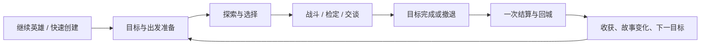

# 本轮游戏设计说明

状态：设计方向与验收原则，2026-09-30。具体任务是否实现以 PROJECT_STATE 和 tasks 为准。

## 玩家想获得什么

一个人也能扮演英雄：带着目标出发，探索未知地点，用角色能力做选择，承受引擎判定的后果，带着收获回城，看到故事与伙伴关系发生变化。

项目是个人爱好作品。保持本地部署、可独立游玩、可选 AI、原生前端和易维护的扩展方式。

## 一次冒险的主要流程

每个阶段都应说明当前目标、可执行的下一步、执行后的实际变化。中断后恢复也要看得出上次停在哪里。

## 已有能力与本轮改进

已有角色成长、战术战斗、四幕主线、静态/程序地牢、城镇、装备、同伴、内容包和 AI 旁白。它们不是本轮待重新实现的功能。

本轮先解决三个体验问题：选择真正生效；慢请求/重读档/重复结算不破坏结果；首页到下一目标的路径清楚。然后降低首次创建负担，再验证一个有两种解法、留下持久后果的小遭遇。

## AI 的角色

- 已有：根据结果写旁白，扮演 NPC，写回顾。
- 本轮后期尝试：解释合法选项，让角色基于已确认事实表现记忆和态度。
- 将来可尝试：把自然语言转成允许的行动提案，交给引擎重新验证。
- 始终由引擎处理骰子、伤害、资源、奖励、成功与失败；AI 文本不能直接修改世界事实。
- 没有模型时，目标、选择和结果完整可用。无需每一步都等待 AI。

## 体验边界

默认界面优先继续、目标、常用行动和下一步；详细 build、统计、管理与其他玩法有清楚的展开入口。保留原有自由探索与自定义创建。

线索只基于已发现内容，目标提示不泄漏隐藏地图或陷阱。按钮明确说明不可用的原因。手机与沉浸模式也能看到当前目标并操作常用行动。

T4/T5 新增的默认面向玩家文案采用简体中文，与现有中文主线一致；保留专有名称。旧界面的逐步翻译和全量多语言框架另立任务。

## 完成的判断

玩家能说出为什么出发、理解一轮行动、识别成功与撤退、确认奖励已保存、指出下一步。后期的分支遭遇应至少有两个可执行解法，并在读档后保留不同回应。

验证包括自动测试、真实浏览器和一次完整试玩。功能数量、HTTP 200、布局不溢出均不能单独证明体验完成。
